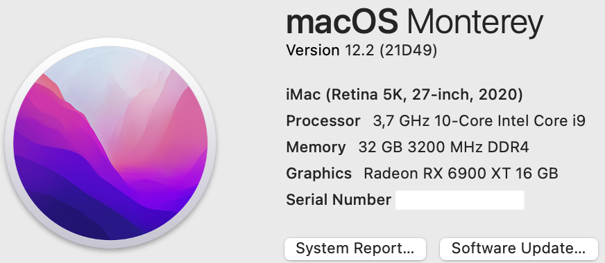
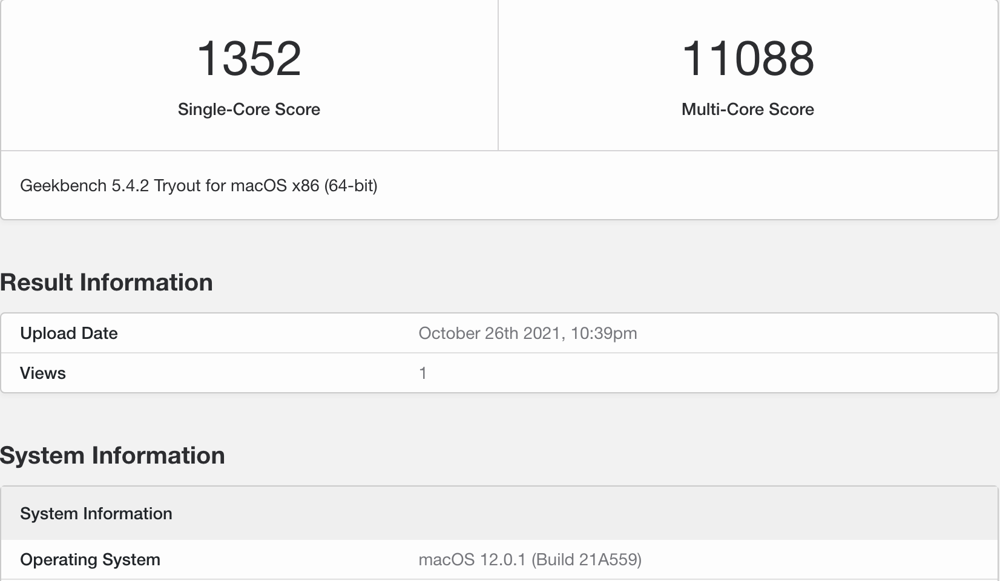
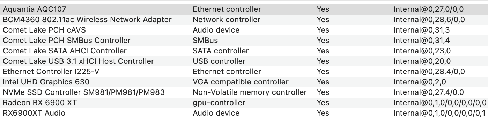
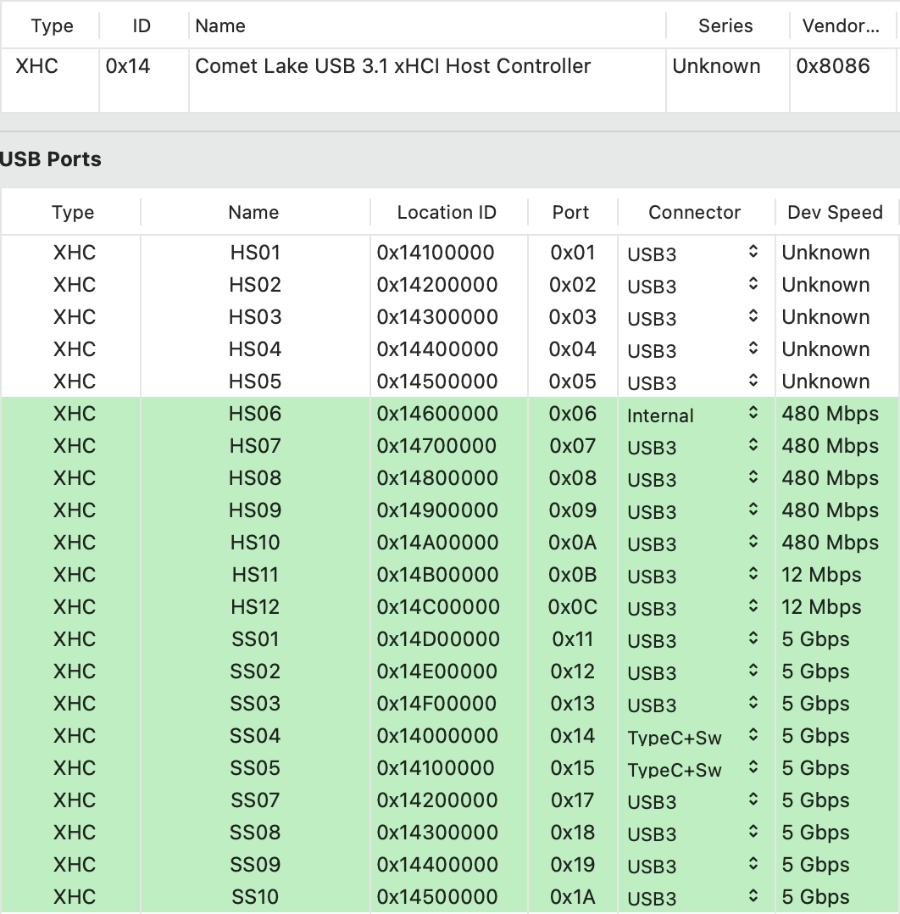

# ASUS-ROG-STRIX-Z490-G-GAMING-10900K
 

  
 

 

  
 

  

  
 

 

  
 

 ## Specs
 | **Component** | **Model** |
| ------------- | --------- |
| CPU | i9-10900K @ 5.3GHz |
| RAM | DDR4 32GB (2x16GB) 3200MHz Crucial Ballistix White RGB |
| Audio Chipset | Realtek ALC1220. Works with layout id 7 |
| dGPU | ASUS ROG-STRIX-LC-RX6900XT-T16G-GAMING. Works with boot agrument agdpmod=pikera plus device-id swap and ACPI table SSDT-BRG0.aml |
| iGPU | Intel UHD Graphics 630 |
| WiFi & Bluetooth | Fenvi T-919 Works OOB |
| Lan |  Intel® 2.5GbE LAN I225-V. Works OOB on Big Sur 11.3 and above with boot argument dk.e1000=0. Does not work on Monterey currently |
| OS Disk | 128GB Samsung 850 Pro SATA |
| macOS | Big Sur 11.6.1 or Monterey 12.0.1/OpenCore 0.7.4 |

## USB issue
I have made a custom USB-Z490G.kext that should be used together with XhciPortLimit kernel quirk. Some ports only work as USB3.0 ports. I could not get the following 5 ports to work with USB 2.0 devices: HS01, HS02, HS03, HS04 and HS05.
 

  
 

 

  
 

  

  
 

 
## Opencore
- Fill in your own PlatformInfo. For Big Sur use iMac20,2 SMBIOS.